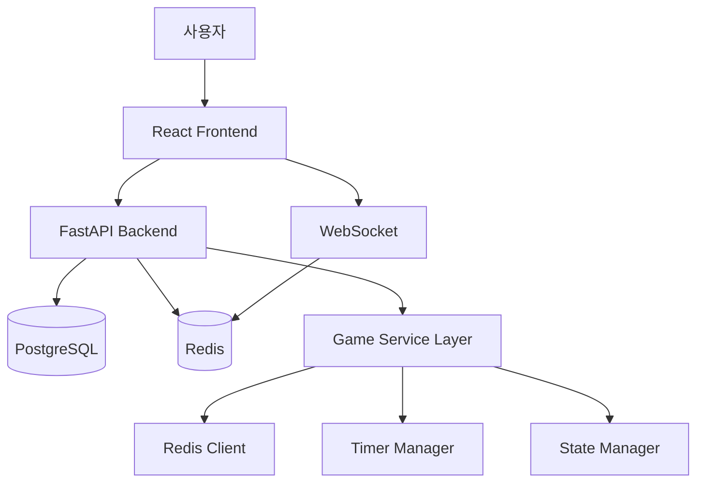

# 🏗️ KKUA 아키텍처 가이드

## 🎯 프로젝트 개요

**끄아(KKUA)**는 실시간 멀티플레이어 끝말잇기 게임으로, 현대적인 웹 기술 스택을 사용하여 구축되었습니다.

## 📚 기술 스택

### Backend
- **FastAPI** - 고성능 비동기 웹 프레임워워크
- **PostgreSQL** - 메인 데이터베이스 (사용자, 게임룸 등)
- **Redis** - 실시간 게임 상태 관리 및 캐싱
- **SQLAlchemy** - ORM 및 데이터베이스 마이그레이션
- **WebSocket** - 실시간 통신

### Frontend
- **React 19** - UI 컴포넌트 라이브러리
- **Zustand** - 상태 관리
- **TailwindCSS** - 스타일링
- **Axios** - HTTP 클라이언트

### DevOps
- **Docker & Docker Compose** - 컨테이너화
- **GitHub Actions** - CI/CD
- **Pre-commit Hooks** - 코드 품질 관리

## 🏛️ 시스템 아키텍처



## 📁 디렉토리 구조

### Backend Structure (Single Responsibility)
```
backend/
├── main.py                    # FastAPI 앱 진입점
├── app_config.py             # 환경별 설정 관리
├── 
├── models/                   # 데이터베이스 모델
│   ├── guest_model.py       # 사용자 모델
│   ├── gameroom_model.py    # 게임룸 모델
│   └── game_log_model.py    # 게임 기록 모델
│
├── services/                # 비즈니스 로직 (리팩토링됨)
│   ├── redis_game_service_v2.py     # 메인 게임 서비스 (조합)
│   ├── game_redis_client.py         # Redis 연결 전담
│   ├── game_timer_manager.py        # 타이머 관리 전담  
│   ├── game_state_manager.py        # 게임 상태 로직 전담
│   ├── gameroom_service.py          # 게임룸 관리
│   └── auth_service.py              # 인증 서비스
│
├── routers/                 # API 엔드포인트
│   ├── auth_router.py       # 인증 API
│   ├── gamerooms_router.py  # 게임룸 CRUD
│   ├── gameroom_ws_router.py # WebSocket
│   └── game_api_router.py   # 게임 플레이 API
│
├── repositories/            # 데이터 접근 계층
├── schemas/                 # Pydantic 모델
├── middleware/              # 미들웨어 (인증, 보안 등)
├── utils/                   # 유틸리티
├── tests/                   # 테스트
└── scripts/                 # 관리 스크립트
    ├── migrate.py           # DB 마이그레이션 도구
    └── init_alembic.py      # Alembic 초기화
```

### Frontend Structure (Component-Based)
```
frontend/src/
├── Pages/                   # 페이지 컴포넌트
│   ├── Loading/            # 로딩/환영 페이지
│   ├── Lobby/              # 메인 로비
│   ├── GameLobbyPage/      # 개별 게임룸
│   ├── InGame/             # 게임 진행
│   └── GameResult/         # 게임 결과
│
├── components/              # 공용 컴포넌트
│   ├── Toast.js            # 알림 컴포넌트
│   ├── WebSocketStatus.js  # 연결 상태 표시
│   └── ProtectedRoute.js   # 라우트 보호
│
├── hooks/                   # 커스텀 훅
│   └── useGameRoomSocket.js # WebSocket 연결 관리
│
├── contexts/                # React Context
│   ├── AuthContext.js      # 인증 상태
│   └── ToastContext.js     # 알림 시스템
│
├── store/                   # Zustand 스토어
├── Api/                     # API 통신 로직
└── utils/                   # 유틸리티
```

## 🔄 데이터 플로우

### 1. 사용자 인증
```
사용자 로그인 → AuthService → Session Cookie → 모든 요청에 포함
```

### 2. 게임룸 생성 및 참여
```
게임룸 생성 → PostgreSQL 저장 → WebSocket 알림 → 실시간 업데이트
```

### 3. 게임 진행 (Dual Architecture)
```
게임 시작 → Redis 게임 상태 생성 → WebSocket 브로드캐스트
단어 제출 → Redis 상태 업데이트 → 타이머 리셋 → 다음 턴
게임 종료 → Redis → PostgreSQL 영구 저장
```

## 🚀 핵심 기능 구현

### 실시간 통신 (WebSocket)
- **연결 관리**: 자동 재연결, 지수 백오프
- **메시지 타입**: 게임 상태, 채팅, 시스템 알림
- **에러 처리**: 연결 실패 시 사용자 알림

### 게임 상태 관리 (Redis)
- **실시간 처리**: 턴 기반 게임 로직
- **타이머 시스템**: 비동기 턴 타이머
- **상태 동기화**: 모든 클라이언트 실시간 동기화

### 데이터 영속성 (PostgreSQL)
- **게임 기록**: 완료된 게임 통계
- **사용자 관리**: 세션 기반 인증
- **게임룸 메타데이터**: 룸 정보 및 참여자

## 🔧 개발 워크플로우

### 1. 로컬 개발
```bash
# 모든 서비스 시작
docker-compose up -d

# 개발 모드로 백엔드 실행
docker exec kkua-backend-1 python -m uvicorn main:app --reload

# 프론트엔드 개발 서버
docker exec kkua-frontend-1 npm start
```

### 2. 테스트
```bash
# 백엔드 테스트
docker exec kkua-backend-1 python -m pytest tests/ -v --cov

# 프론트엔드 테스트  
docker exec kkua-frontend-1 npm test -- --coverage
```

### 3. 코드 품질
```bash
# 백엔드 린팅
docker exec kkua-backend-1 ruff check . --fix

# 프론트엔드 린팅
docker exec kkua-frontend-1 npx eslint --fix src/
```

### 4. 데이터베이스 마이그레이션
```bash
# 새 마이그레이션 생성
docker exec kkua-backend-1 python scripts/migrate.py create "설명"

# 마이그레이션 적용
docker exec kkua-backend-1 python scripts/migrate.py upgrade
```

## 🔒 보안 아키텍처

### 인증 & 인가
- **Session-based Auth**: HTTP-only 쿠키
- **CSRF Protection**: CSRF 토큰 검증
- **Rate Limiting**: API 요청 제한

### 데이터 보안
- **Environment Variables**: 민감 정보 분리
- **Input Validation**: Pydantic 스키마 검증
- **SQL Injection Prevention**: SQLAlchemy ORM

### 네트워크 보안
- **HTTPS Only** (Production)
- **CORS 설정**: 허용된 도메인만
- **Security Headers**: HSTS, CSP 등

## 📊 모니터링 & 로깅

### 구조적 로깅
```python
logger.info(f"게임 시작: room_id={room_id}, 참가자={len(participants)}명")
logger.error(f"게임 생성 실패: room_id={room_id}, error={e}", exc_info=True)
```

### 성능 메트릭
- **WebSocket 연결 수**: 실시간 모니터링
- **게임 진행 시간**: 평균 게임 지속시간
- **에러 율**: 서비스별 에러 발생률

### 로그 파일
```
logs/
├── kkua.log         # 일반 애플리케이션 로그
├── error.log        # 에러 전용 로그
├── security.log     # 보안 관련 로그
└── performance.log  # 성능 관련 로그
```

## 🎯 성능 최적화

### 백엔드 최적화
- **Redis 연결 풀링**: 최대 20개 연결
- **비동기 처리**: FastAPI + asyncio
- **선택적 브로드캐스트**: 중요 시점만 메시지 전송
- **데이터베이스 인덱싱**: 쿼리 성능 최적화

### 프론트엔드 최적화
- **클라이언트 사이드 타이머**: 서버 부하 감소
- **캐시 관리**: API 응답 캐싱
- **컴포넌트 최적화**: React.memo, useMemo 사용
- **번들 최적화**: 코드 스플리팅 (향후 계획)

## 🔮 확장 계획

### 단기 목표
- [ ] 게임 아이템 시스템
- [ ] 다양한 게임 모드
- [ ] 관전자 모드
- [ ] 게임 리플레이

### 장기 목표
- [ ] 마이크로서비스 분리
- [ ] Kubernetes 배포
- [ ] 실시간 음성 채팅
- [ ] AI 봇 플레이어

---

**💡 이 아키텍처는 확장성, 유지보수성, 성능을 고려하여 설계되었으며, 현대적인 웹 애플리케이션의 모범 사례를 따릅니다.**